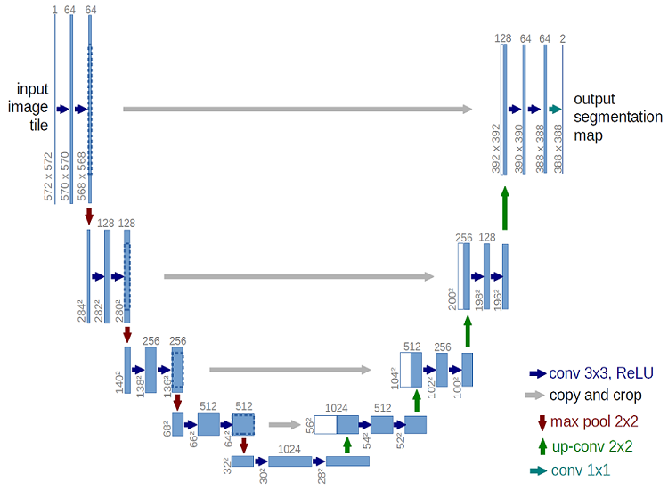

CT Lung Images Segmentation
===
CT lung images segmentation implementation using UNet. 

 
### Data
1. The Kaggle dataset at https://www.kaggle.com/kmader/finding-lungs-in-ct-data.
2. The CNBC dataset at http://ncov-ai.big.ac.cn/download

### Pre-Processing
1. On the Kaggle dataset, after importing the image data from the alpha channel, convert unsigned int image to int and resize to 512 x 512
   Run preprocessing_lungs-Kaggle.ipynb
3. On the CNBC dataset, merge lung field mask, GC lesions and consolidation lesion marks all to the lung field mask, resize to 512x512.
   Run preprocessing_lungs-CNCB.ipynb

### Training
   Run python train.py 

### Generate lung mask on dataset 
   Run python segement_train_val.py on training and validation dataset 
   Run python segement_test.py on test dataset 

Requirement
---
* Python
* Keras-2.3, Tensorflow-GPU-2.2
* Python packages : numpy, matplotlib, opencv, and so on...

### Reference Implementations
---
+ https://github.com/IzPerfect/CT-Image-Segmentation

